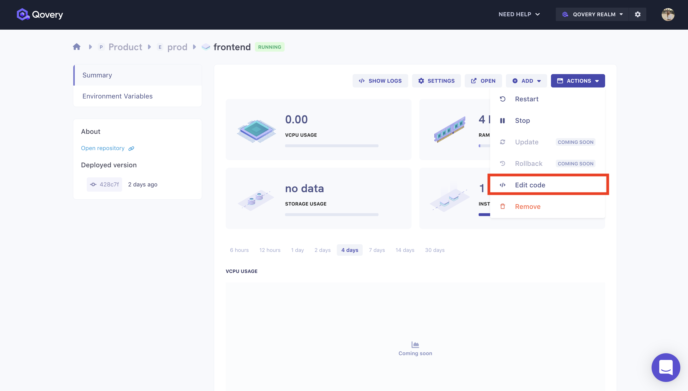
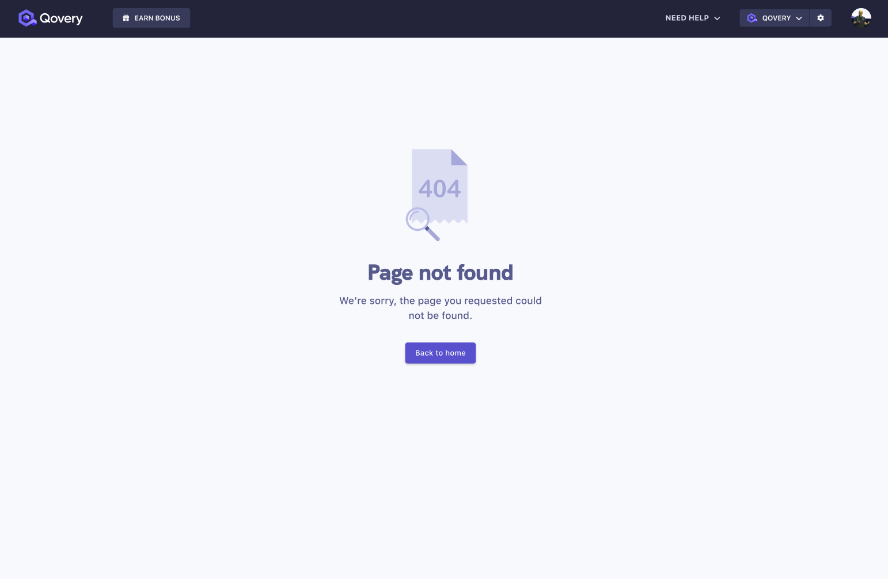

# October 15th, 2021 Release
---
Welcome to our first ever Qovery changelog! From now on we'll be publishing every two weeks all the updates, improvements and bug fixes made to Qovery. Don't forget to join our community on Discord to know the exact release date of those features. 
{: .alert .alert-info .text-justify}

## ADDED - "Edit code" button for applications
You can now edit your code in the blink of an eye with this new addition.

Head to your application → action dropdown → "edit code" → you will be redirected to Gitpod where you can then change the desired part of your code and push it, this action will re deploy your application on Qovery with the correct modifications.

## CHANGED - A brand new 404 page
Say goodbye to the good old boring default 404 and hello to our new error page.

## CHANGED - Remove the limit number of fetched git repositories
We used to fetch a maximum of 500 git repositories but some of you are working really hard and have a lot more so we decided to remove this limit to make sure that you can deploy any repositories from your git account.

## CHANGED - More meaningful messages when the deployment fail
Until now the message shown when a deployment was failing was a simple "Application could not be deployed" as this message is not relevant enough we are now using the error response from the backend to give you a clearer explanation. 

# Smaller improvements and fixes
* CHANGED - Prompt user to redeploy his app after settings change
* FIX - Enable navigation to the environment from logs screen
* FIX - Branch selector / disable the field until a repository is selected
* FIX - We corrected the issue on the queue that caused deployment stuck
* FIX - Review cluster status colors 